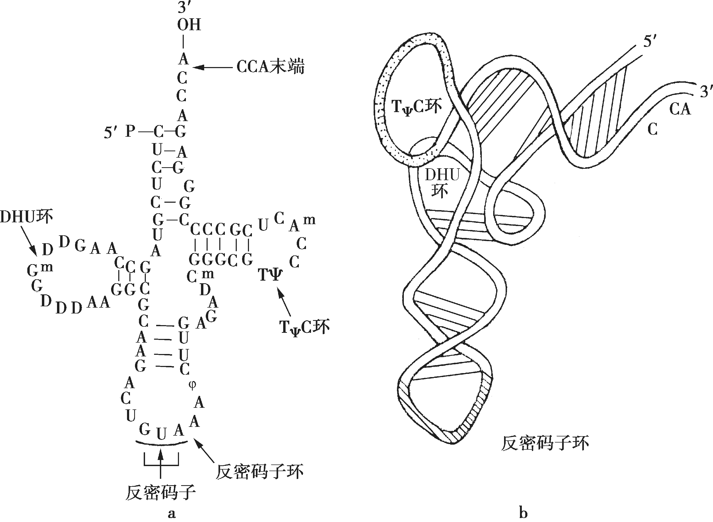

# Genetic-evolution
DOI：/10.1038/s41586-022-04677-2
nature， 22 March 2022

# Reversible RNA phosphorylation stabilizes tRNA for cellular thermotolerance
## 可逆的RNA磷酸化稳定了tRNA的细胞热耐受性  
### 摘要
转录后修饰在tRNA的稳定性和功能中起着关键作用。在嗜热生物中，trna被大量修饰，以在极端生长温度下保持其热稳定性。在这里，我们从嗜热古菌tRNAs的47位鉴定了2‘-磷酸嘧啶(Up)。Up47具有对tRNAs的热稳定性和核酸酶抗性。天然古菌tRNA的原子结构显示出一种独特的由Up47稳定的亚稳态核心结构。Up47的2‘-磷酸从tRNA核心突出，并在热变性过程中阻止主干旋转。此外，我们还鉴定了arkI基因，该基因编码一种负责Up47形成的古菌RNA激酶。结构研究表明，ArkI有一个非典型的激酶基序，周围有一个带正电荷的tRNA结合补丁。一个敲除arkI的菌株在高温下生长缓慢，当第二种trna修饰酶被耗尽时，它表现出合成生长缺陷。我们还鉴定了KptA的古同源物作为擦除剂，可以在体内和体外有效地去磷酸化Up去磷酸47。综上所述，我们的fn研究表明，Up47是一种由ArkI和KptA介导的可逆RNA修饰，可以在极端环境条件下调节tRNA的结构刚性。

## introduction   
* tRNA包含80%的RNA修饰，聚集在反密码子环中（尤其是34，37）
* 稳定、调节密码子-反密码子相互作用；二氧甲基化赋予tRNA核心区域构象刚性
* 在嗜热细菌和古细菌中，独特的RNA修饰有助于tRNAs的热适应
[可能有用参考文献1](./references/1-microorganisms-2018-06-00110.pdf)
[可能有用参考文献2](./references/2-biomolecules-2017-07-00035.pdf)

## 创新点  
报道了在tRNAs中对2‘-磷酸核苷(Up)的鉴定，这是已知的第一个内部RNA磷酸化的实例。生化、结构和遗传学研究表明，Up47是一种可逆的RNA修饰，赋予tRNA热稳定性，从而促进细胞的耐热性。

## Discovery of Up in tRNA  

1. 通过质谱分析（RNA-MS）→ 确定13种tRNA修饰，发现N324/U47
2. 通过 High-resolution mass analysis → 确定多一个P；通过collision-induced dissociation (CID)+生化构建的方法 → 确定P发生在2'位，命名为Up47
* 使用分析物种：Sulfolobus tokodaii 一种超嗜热古细菌
* 分类： Kingdom- Archaea, Phylum-Crenarchaeota, Class-Thermoprotei, Order-Sulfolobales, Family-Sulfolobaceae，Genus-Sulfolobus古菌界-泉古菌门，热变形菌纲，硫化叶目，硫化叶科，硫化叶属_
* 特性+其他：嗜热嗜酸性细菌，硫化叶属主要物种之一，常用研究菌株S. tokodaii sp strain7，该菌株比其他任何已知的菌株都更接近真核生物
[更多资料](https://microbewiki.kenyon.edu/index.php/Sulfolobus_tokodaii) ;[百度](https://baike.so.com/doc/1127915-1193240.html)

## Up47 stabilizes tRNA structure  

因为原有研究发现，tRNA上修饰具有稳定结构的作用，且该类细菌生活环境极端，因此探究其修饰带来的结构影响

1. 用酵母Tpt1p（2‘-磷酸转移酶）处理tRNA（S. tokodaii tRNAVal3）测定有无Up47的熔化温度 → 有修饰的温度更高更稳定
2. 用RNase检测有无Up47的核酸酶抗性 → 没有Up47的tRNA降解更快

## Structural study of Up47 in native tRNA  

## Identification of an RNA kinase for Up47 在2'写入磷酸基团的基因鉴定  
To identify a gene responsible for Up47 formation, we narrowed down the candidate genes in the S. tokodaii genome by performing a comparative genomic analysis of sequenced genomes using RECOG (http://mbgd.genome.ad.jp/RECOG/). According to our analysis of Up47 distribution in archaeal species (Supplementary Note 4, Extended Data Fig. 8a–d), Up47 is present in seven archaeal species, including in S. tokodaii, but is absent in two species (Fig. 3a). Among the 2,826 genes encoded in the S. tokodaii genome, only nine genes (Supplementary Table 4) were commonly found in all seven archaeal species with Up47 (Fig. 3b). Among them, five genes (Supplementary Table 4) were of uncharacterized function (Fig. 3b). We chose one gene encoding a putative protein kinase, STK_09530 (hypothetical serine/threonine kinase, COG2112), as a strong candidate (Fig. 3b). STK_09530 resides in an operon containing a gene for a tRNA nucleotidyltransferase STK_09520), implying that it encodes an enzyme related to tRNA maturation. We then constructed a strain of T. kodakarensis lacking tk2051, an orthologue of STK_09530. The tRNA fraction obtained from the Δtk2051 strain was subjected to liquid chromatography followed by MS (LC–MS) nucleotide analysis. A pUpm5C dimer was clearly observed in the parental strain (wild type) of T. kodakarensis (KU216), but was absent in the Δtk2051 strain (Fig. 3c). Therefore, tk2051 is the gene responsible for Up47 formation in cells. We designated the gene arkI(archaeal RNA
* 目的：确定一个负责Up47形成的基因
1.
* 材料： S. tokodaii genome等9种古细菌，其他真核生物和细菌
* 方法：使用recog(http://mbgd.genome.ad.jp/RECOG/)对测序基因组进行比较基因组分析，缩小了该基因组的候选基因范围;在古菌生物中分析  
结果：在7中古菌中存在，在2种中缺失
图注：
不含Up47：Bacteria (E. coli), Eukarya (Homo sapiens, S. cerevisiae and Arabidopsis thaliana) and Archaea (Methanosarcina acetivorans, 
Thermoplasma acidophilum,）
含Up47：S. tokodaii, Sulfolobus acidocaldarius, Saccharolobus solfataricus, Aeropyrum pernix, Pyrobaculum oguniense, T. kodakarensis and Nitrososphaera viennensis  

2.
* 材料： S. tokodaii genome
* 方法： 
* 结果： S. tokodaii genome基因组一共编码2826个基因，含有Up47的7个古细菌中共同含有的基因一共9个；其中5个是和写入甲基化无关的基因，于是排除；最后选定了一共推测的蛋白激酶 STK_09530，STK_09530位于一个包含tRNA核苷酸转移酶(STK_09520)基因的操纵子中，这意味着它编码一种与tRNA成熟相关的酶。

构建了缺乏STK_09530同源基因tk2051的 T. kodakarensis菌株。从Δtk2051菌株中获得的tRNA部分进行液相色谱，然后进行MS(LC-MS)核苷酸分析。在 T. kodakarensis野生菌株(KU216)中明显可见pUpm5C二聚体，但在Δtk2051菌株中缺失(图3c)。因此，tk2051是细胞中负责Up47形成的基因。我们将该基因命名为arkI(古菌RNA激酶)。
